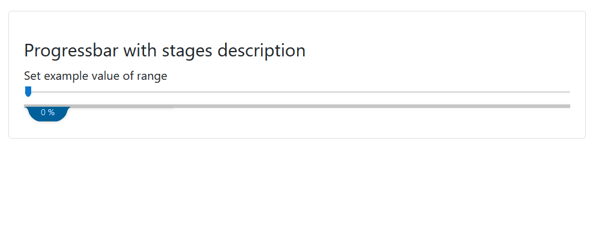

# react-water-progressbar


[](https://www.npmjs.com/package/react-water-progressbar) [](https://standardjs.com)

## Install

```bash
npm install --save react-water-progressbar
```

## Demo
[custom-item-select](https://ktomecki.github.io/react-water-progressbar/)




## Usage

```jsx
import React from 'react'
import { Example } from './utils'

import Progressbar from 'react-water-progressbar'

export default function () {
    const [value, setValue] = React.useState(50)
    return (
        <Example>
            <h4>Progressbar with stages description</h4>
            Set example value of range<br/>
            <input style={{width: '100%'}} type="range" value={value} onChange={e => setValue(e.target.value)} />
            <Progressbar
                percent={value}
                text={`${value} %`}
                items={[
                    { done: value > 20, component: "Stage 1" },
                    { done: value > 40, component: "Stage 2" },
                    { done: value > 60, component: "Stage 3" },
                    { done: value > 80, component: "Stage 4" },
                    { done: value > 99, component: "Stage 5" }
                ]}
            />
        </Example>
    )
}
```

> Made with create-react-library

## License

MIT © [ktomecki](https://github.com/ktomecki)
